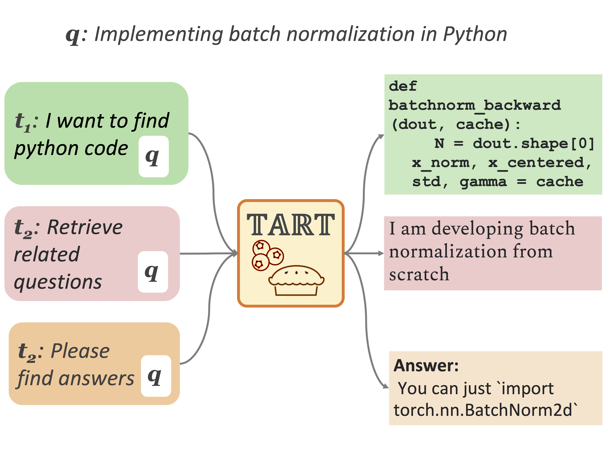

# Task-aware Retrieval with Instructions

This is the official repository for our preprint, [Task-aware Retrieval with Instructions](https://arxiv.org/abs/2211.09260). 

We introduce a new retrieval task formulation, **retrieval with instructions**, constructs **BERRI**, the first large-scale collection of retrieval datasets with instructions, and present **TART**, multi-task instruction-following retrieval models trained on BERRI. 

<p align="center">
  
</p>

## Content

1. [Getting started](#getting-started)
2. [Pretrained Checkpoints](#pre-trained-checkpoints)
    - [Pre-trained checkpoints ](#pre-trained-checkpoints)
    - [Embeddings](#embeddings)
3. [Evaluation](#evaluation)
    - [BERRI](#beir)
    - [LOTTE](#lotte)
    - [Cross-task Cross-domain evaluation](#cross-task-cross-domain-dataset)
4. [Training](#training)
5. [Dataset: BERRI](#dataset-berri)
5. [Citations and Contact](#citation-and-contact)


## Getting started
Pre-trained models can be loaded through the HuggingFace transformers library:

```py
from src.modeling_enc_t5 import EncT5ForSequenceClassification
from src.tokenization_enc_t5 import EncT5Tokenizer
import torch
import torch.nn.functional as F
import numpy as np
# load TART full and tokenizer
model = EncT5ForSequenceClassification.from_pretrained("facebook/tart-full-flan-t5-xl")
tokenizer =  EncT5Tokenizer.from_pretrained("facebook/tart-full-flan-t5-xl")
```

Then, you can test TART-full as follows: 
```py
model.eval()
q = "What is the population of Tokyo?"
in_answer = "retrieve a passage that answers this question from Wikipedia"

p_1 = "The population of Japan's capital, Tokyo, dropped by about 48,600 people to just under 14 million at the start of 2022, the first decline since 1996, the metropolitan government reported Monday."
p_2 = "Tokyo, officially the Tokyo Metropolis (東京都, Tōkyō-to), is the capital and largest city of Japan."

# 1. TART-full can identify more relevant paragraph. 
features = tokenizer(['{0} [SEP] {1}'.format(in_answer, q), '{0} [SEP] {1}'.format(in_answer, q)], [p_1, p_2], padding=True, truncation=True, return_tensors="pt")
with torch.no_grad():
    scores = model(**features).logits
    normalized_scores = [float(score[1]) for score in F.softmax(scores, dim=1)]

print([p_1, p_2][np.argmax(normalized_scores)]) # "The population of Japan's capital, Tokyo, dropped by about 48,600 people to just under 14 million ... "

# 2. TART-full can identify the document that is more relevant AND follows instructions.
in_sim = "You need to find duplicated questions in Wiki forum. Could you find a question that is similar to this question"
q_1 = "How many people live in Tokyo?"
features = tokenizer(['{0} [SEP] {1}'.format(in_sim, q), '{0} [SEP] {1}'.format(in_sim, q)], [p, q_1], padding=True, truncation=True, return_tensors="pt")
with torch.no_grad():
    scores = model(**features).logits
    normalized_scores = [float(score[1]) for score in F.softmax(scores, dim=1)]

print([p_1, q_1][np.argmax(normalized_scores)]) #  "How many people live in Tokyo?"

```
As you can see, TART not only gives lower scores to the wrong query (q_1 v.s. q_2), but also gives a lower score to the document that is relevant but does not follow the instruction. 

### Interactive mode
Interactive mode enables you to type whatever questions and retrieve pre-encoded documents. To run this interactive mode, you need to encode documents, as well as the models. 

```sh
python interactive.py \
--passages scifact/corpus.jsonl \
--passages_embeddings "PATH_TO_YOUR_EMBEDDINGS/*" \
--model_name_or_path PATH_TO_YOUR_BE_MODEL \
--ce_model PATH_TO_YOUR_CE_MODEL \
```


## Pre-trained checkpoints 
### TART-full
We release TART-full models trained on BERRI using different initial encoder weights. Our TART-full model on the paper is based on T0-3B. We will release TART-full using smaller model soon! 

Models are all on huggingface hub.

| name      | size | initialization | 
| ----------- | ----------- | ----------- |
| [facebook/tart-full-flan-t0-3b](https://huggingface.co/facebook/tart-full-flan-t0-3b) |   1.5 billions     |[T0-3B](https://huggingface.co/bigscience/T0_3B)|
|  [facebook/tart-full-flan-t5-xl](https://huggingface.co/facebook/tart-full-flan-t5-xl) |  1.5 billions | [FLANT5-XL](https://huggingface.co/google/flan-t5-xl)|

### TART-dual 
TART-dual is an efficient bi-encoder model sharing an encoder for document and query encodings. 
| name      | size | initialization | 
| ----------- | ----------- | ----------- |
| [facebook/tart-dual-contriever-msmarco](https://homes.cs.washington.edu/~akari/models/tart-dual-contriever-msmarco.zip) |   110 millions     |[facebook/contriever-msmarco](https://huggingface.co/facebook/contriever-msmarco)|

The main model on the paper uses [Contriever-MS MARCO](https://huggingface.co/facebook/contriever-msmarco) pre-trained on Wikipedia 2020 dump. 

## Embeddings
We release the pre-encoded embeddings for the BEIR datasets here:
```
https://homes.cs.washington.edu/~akari/embeddings_inst_dpr.zip
```

## Evaluation
### BEIR
You can evaluate the models on BEIR, by running `eval_beir.py` or `eval_cross_task.py`. 

`eval_beir.py` is adopted from the official BEIR repository, encodes and runs inference using a single GPU every time, while `eval_cross_task.py` assumes that you have encoded document embeddings and parallelize inference using multiple GPUs. If you have multiple GPUs or try to evaluate TART on datasets with millions of documents (e.g., Climate-FEVER), we recommend using `eval_cross_task.py` script. 

#### Run evaluation with `eval_beir.py`

```sh
python eval_beir.py \
    --model_name_or_path BI_ENCODER_MODEL_NAME_OR_PATH \
    --dataset BEIR_DATASET_NAME \
    --output_dir YOUR_OUTPUT_DIR
    --model_name_or_path BI_ENCODER_MODEL_NAME_OR_PATH \
    --ce_model CROSS_ENCODER_MODEL_NAME_OR_PATH \
    --prompt  "YOUR INSTRUCTIONS"
```


#### Run evaluation with `eval_cross_task.py`
As mentioned above, there are two steps to run `eval_cross_task.py` script: **STEP1: encode all documents**, and **STEP2: run evaluations using encoded embeddings**. 

##### STEP1: Encode all of the document
To encode document using a single GPU, please run the command below: 

```sh
python generate_passage_embeddings.py --model_name_or_path YOUR_MODEL_NAME --output_dir OUTPUT_DIR_NAME \
    --passages PATH_TO_YOUR_INPUT_DATA_DIR/corpus.jsonl --shard_id ${i} --num_shards 1
```

If you want to use multiple GPUs to speed up the process, you can run the following command: 

```sh
for i in {0..7}; do
  export CUDA_VISIBLE_DEVICES=${i}
  nohup python generate_passage_embeddings.py --model_name_or_path BI_ENCODER_MODEL_NAME_OR_PATH --output_dir OUTPUT_DIR_NAME \
      --passages PATH_TO_YOUR_INPUT_DATA_DIR/corpus.jsonl --shard_id ${i}  --num_shards 8 > ./log/nohup.log.${i} 2>&1 &
done
```

The corpus file is a `jsonlines` file, where each item contains `text` and `title`, and optional `_id` and `meta_data`. 

e.g., 

```
{"_id": "doc9", "title": "Chicago Fire (season 4)", "text": "Hermann is rushed to Chicago Med after being stabbed at Molly's. After losing a lot a blood, it is determined he needs emergency surgery. Feeling guilty about Hermann's present state, Cruz searches for Freddy to turn him in. Severide is reinstated as Lieutenant while Borelli grows more concerned about Chili's erratic behavior. Mouch considers finally proposing to Platt.", "metadata": {}}
``` 

##### STEP2: Run predictions 

Once you encode passages, you can run the evaluations as follows: 
```sh
python eval_cross_task.py \
    --passages PATH_TO_YOUR_INPUT_DATA_DIR/corpus.jsonl \
    --passages_embeddings "PATH_TO_YOUR_EMBEDDING_OUTPUT_DIR/passages_*" \
    --qrels PATH_TO_YOUR_INPUT_DATA_DIR/qrels/test.csv  \
    --output_dir OUT_PUT_DIR_NAME \
    --model_name_or_path BI_ENCODER_MODEL_NAME_OR_PATH \
    --ce_model CROSS_ENCODER_MODEL_NAME_OR_PATH \
    --data PATH_TO_YOUR_INPUT_DATA_DIR/queries.jsonl \
    --prompt  "YOUR INSTRUCTIONS"
```

### LOTTE
We evaluate our model on LOTTE-search (pooled). To run the evaluations on LOTTE, you can download our processed data (the data itself is the same but we convert the input data file formats and add instructions) as follows:

```sh
wget https://homes.cs.washington.edu/~akari/tart/processed_lotte_search_pooled.zip
unzip processed_lotte_search_pooled.zip
```

Encode passages as in the previous section. 

```sh
for i in {0..7}; do
  export CUDA_VISIBLE_DEVICES=${i}
  nohup python generate_passage_embeddings.py --model_name_or_path BI_ENCODER_MODEL_NAME_OR_PATH --output_dir OUTPUT_DIR_NAME \
      --passages processed_lotte_search_pooled/corpus.jsonl --shard_id ${i}  --num_shards 8 > ./log/nohup.log.${i} 2>&1 &
done
```

Once you encode the passages, you can run evaluations 
```sh
python eval_cross_task.py \
    --passages processed_lotte_search_pooled/corpus.jsonl \
    --passages_embeddings "contriever_lotte_corpus/passages_*" \
    --qrels processed_lotte_search_pooled/qrels/test.tsv \
    --output_dir OUT_PUT_DIR_NAME \
    --model_name_or_path BI_ENCODER_MODEL_NAME_OR_PATH \
    --ce_model CROSS_ENCODER_MODEL_NAME_OR_PATH \
    --data processed_lotte_search_pooled/queries_w_instructions_sep.jsonl \
    --lotte
```
This code output the lotte's official evaluation script format data under `CROSS_ENCODER_MODEL_NAME_OR_PATH/`
Then you can run the official evaluation script as follows: 

```sh
cp lotte
python evaluate_lotte_rankings.py --k 5 --split test --data_path  ../lotte --rankings_path PATH_TO_PREDICTION_FILE
```

### Cross-task Cross-domain dataset 
In this paper, we newly introduce cross-task cross-domain evaluation, where given an instruction and a single large-scale domain, a system needs to retrieve documents that follow instructions. 

Due to legal reasons, Meta cannot host this data. The script to create cross-task cross-domain dataset is available at [cross_task_cross_domain](), and you can also download the processed cross task dataset as follows.

```sh
wget https://homes.cs.washington.edu/~akari/tart/cross_task_cross_domain_final.zip
unzip https://homes.cs.washington.edu/~akari/tart/cross_task_cross_domain_final.zip
```

Due to the larger corpus, we highly recommend encoding every documents beforehand. 
Encoded documents are available at the [encoded documents](embeddings) Section. 

Then you can run evaluations on the cross-task cross-domain data as follows: 
```sh
python eval_cross_task.py \
    --passages ../cross_2_eval/nq/corpus.jsonl ../cross_tacross_2_evalsk_eval/scifact/corpus.jsonl ../cross_2_eval/gooaq_med/corpus.jsonl ../cross_2_eval/linkso_py/corpus.jsonl ../cross_2_eval/ambig/corpus.jsonl ../cross_2_eval/wikiqa/corpus.jsonl ../cross_2_eval/gooaq_technical/corpus.jsonl ../cross_2_eval/codesearch_py/corpus_new.jsonl \
--passages_embeddings "linkso_py_contriever_embeddings/passages_*" "ambig_contriever_embeddings/passages_*" "scifact_contriever_embeddings/*" "nq_contriever_embeddings/passages_*" "gooaq_technical_contriever_embeddings/passages_*" "codesearch_py_contriever_embeddings/passages_*" "wikiqa_contriever_embeddings/passages_*" \
--qrels ../cross_task_eval/linkso/qrels/test_new.tsv \
--output_dir YOUR_OUTPUT_DIR \
--model_name_or_path BI_ENCODER_MODEL_NAME_OR_PATH \
--ce_model CROSS_ENCODER_MODEL_NAME_OR_PATH \
```

## Training 
We will release the detailed instructions for training with BERRI soon. 

## Dataset: BERRI
Due to legal reasons, Meta cannot host reproduced Wikidata. We will release scripts to reproduce BERRI by downloading checkpoints, converting the inputs and running models to collect positive and negative datasets. 


## Citation and Contact 
If you find this repository helpful, please cite our paper. 

```
@article{asai2022tart,
  title={Task-aware Retrieval with Instructions},
  author={Asai, Akari and Schick, Timo and Lewis, Patrick and Chen, Xilun and Izacard, Gautier and Riedel, Sebastian and Hajishirzi, Hannaneh and Yih, Wen-tau},
  journal={arXiv preprint arXiv:2211.09260},
  year={2022}
}
```

If you have any questions about the paper, feel free to contact Akari Asai (akari[at]cs.washington.edu) or open an issue, and mention @AkariAsai

### License
See the [LICENSE](LICENSE) file for more details.
